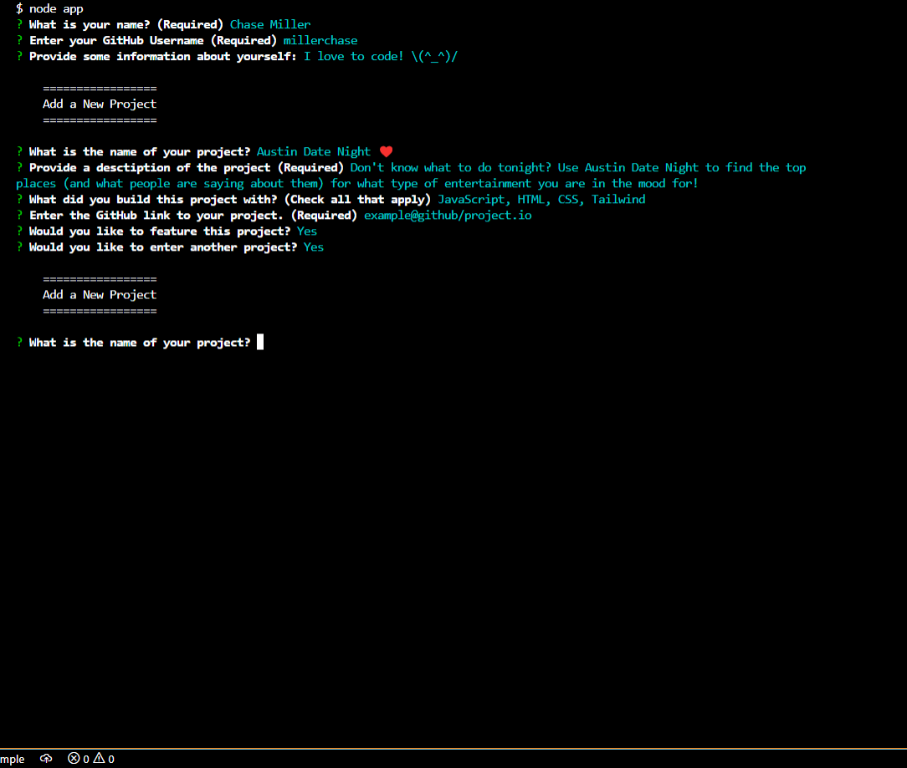
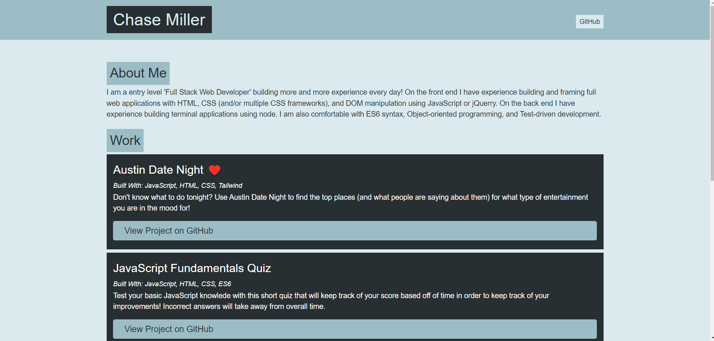

# Portfolio Generator

## Description

Use your terminal to quickly generate a portfolio page for displaying your GitHub projects.

#### Prompted input from user

* User Information:
    * User Name
    * User GitHub Username
    * About Me Info (Optional)

* Project Information:
    * Project Name
    * Project Description
    * Project GitHub Repo Link

[Link to finished product example](https://millerchase.github.io/portfolio-generator/)

## Requirements:

* Node
* Git

#### Common Setup

Clone the repo and install the dependencies.

` 
git clone https://github.com/millerchase/portfolio-generator.git
cd portfolio-generator
`
`npm install`

### Screen Shot (Process)

### Screen Shot (Display)

## Made With:

* Node
* JavaScript
* ES6

## Contributors

Made with ❤️ by Chase Miller.